<div align="center">

# SmartMart POS & Inventory Control System

### A secure, transaction-driven Management Information System for retail operations

[](https://react.dev/)
[](https://www.typescriptlang.org/)
[](https://fastapi.tiangolo.com/)
[](https://www.mysql.com/)

[](https://vite.dev/)
[](https://tailwindcss.com/)
[](https://www.sqlalchemy.org/)
[](https://www.rfc-editor.org/rfc/rfc7519)
[](https://vitest.dev/)

**React + FastAPI + MySQL · Role-based access · Atomic stock transactions · Decision-support reporting**

</div>

---

## Overview

SmartMart is a full-stack **Point of Sale and Inventory Control Management Information System** created as an academic business case for a retail store. It replaces fragmented sales, purchasing and stock records with one controlled system that connects operational transactions to inventory updates, audit histories, dashboards and managerial reports.

This project goes beyond basic CRUD operations:

- **Transaction Processing System (TPS):** records sales, purchases, invoice lines and stock movements.
- **Supply-chain support:** connects products with suppliers, receives stock and identifies items requiring replenishment.
- **Decision Support System (DSS):** transforms trusted operational data into KPIs, alerts, valuation, profitability and customer analysis.

> SmartMart Retail Store is a fictional academic business case. Demonstration values shown in this repository are not production business results.

## Table of Contents

- [Why this project exists](#why-this-project-exists)
- [System preview](#system-preview)
- [Key capabilities](#key-capabilities)
- [Roles and permissions](#roles-and-permissions)
- [Architecture](#architecture)
- [Technology stack](#technology-stack)
- [Transaction integrity](#transaction-integrity)
- [Security model](#security-model)
- [Database design](#database-design)
- [Decision-support reports](#decision-support-reports)
- [Verified demonstration evidence](#verified-demonstration-evidence)
- [Project structure](#project-structure)
- [Local setup](#local-setup)
- [Testing evidence](#testing-evidence)
- [Known limitations](#known-limitations)
- [Roadmap](#roadmap)
- [Academic information](#academic-information)

## Why this project exists

Retail operations become unreliable when sales, purchasing and stock are maintained in disconnected paper records or spreadsheets. The resulting problems include delayed stock updates, incorrect totals, weak accountability, duplicate data and limited visibility for managers.

SmartMart addresses this by providing:

- one source of truth for products, categories, customers and suppliers;
- server-validated sales and purchase workflows;
- automatic stock deduction and replenishment;
- role-specific navigation and endpoint authorization;
- traceable sales and purchase histories;
- threshold-based low-stock alerts;
- dashboards, charts and CSV-ready managerial reports.

## System preview

### Secure login and operational dashboard

<p align="center">
  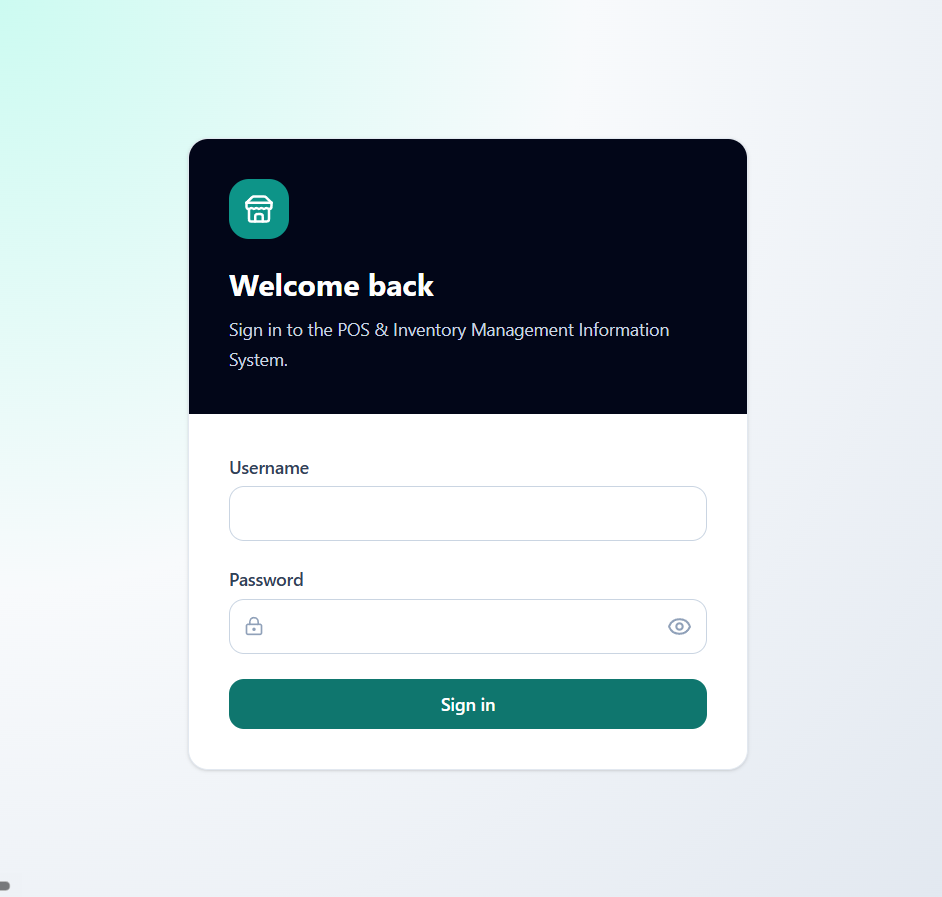
  &nbsp;&nbsp;
  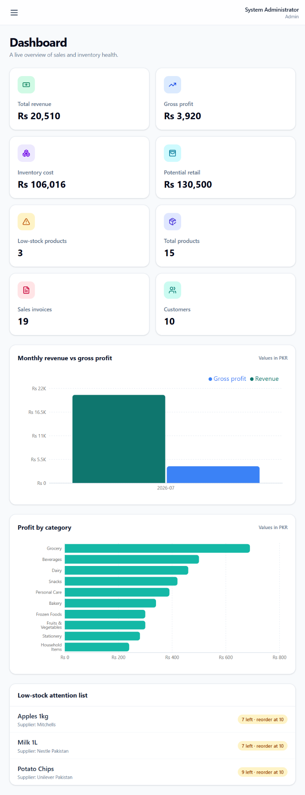
</p>

### Point of sale and traceable invoice

<p align="center">
  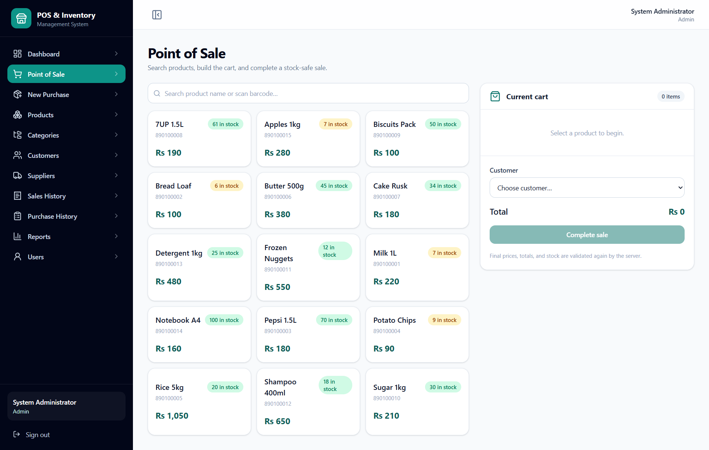
  &nbsp;&nbsp;
  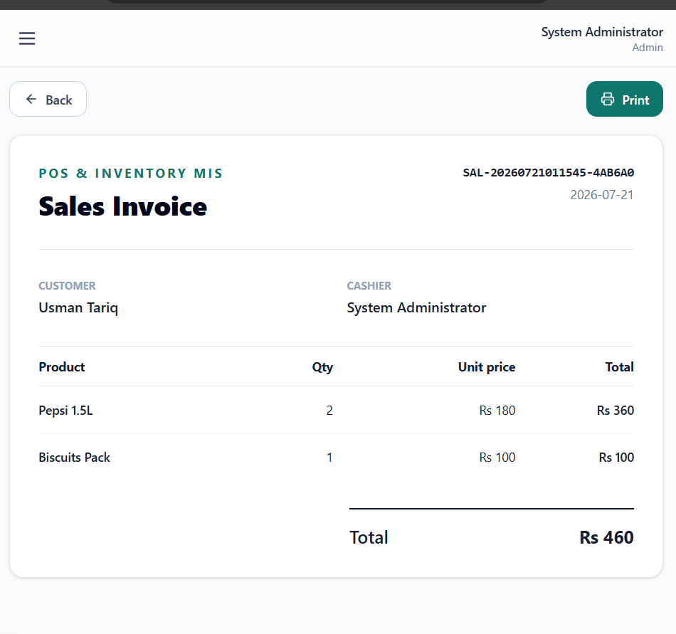
</p>

### Purchasing and decision support

<p align="center">
  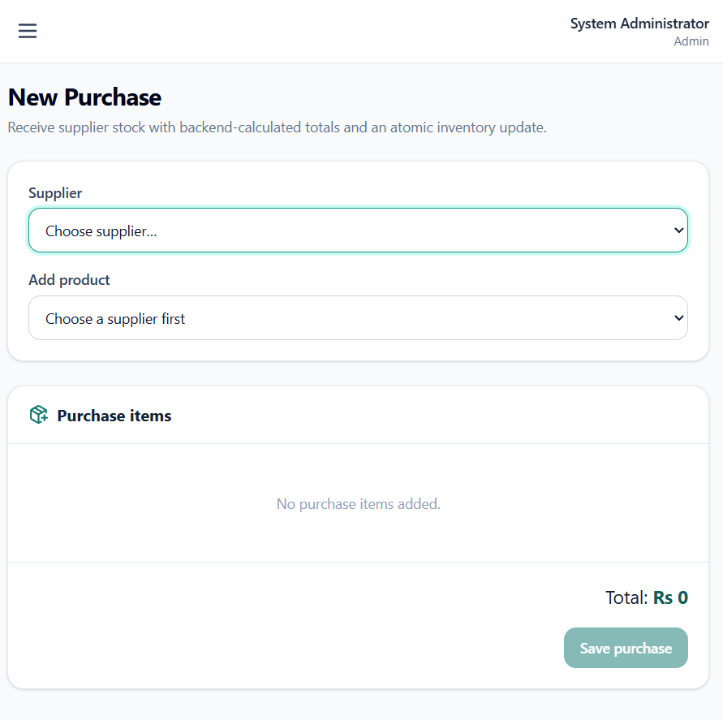
  &nbsp;&nbsp;
  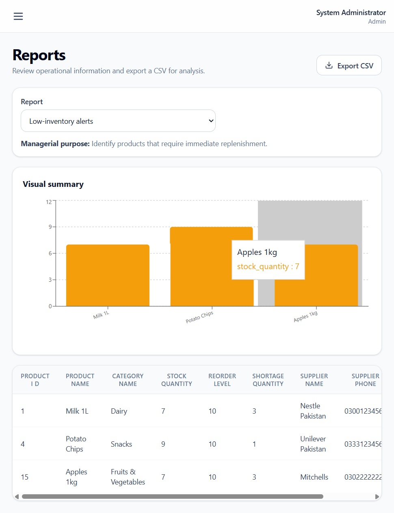
</p>

## Key capabilities

### Point of Sale

- Search by product name or barcode.
- View current stock and selling price.
- Build a multi-product cart and select a customer.
- Revalidate prices, quantities and stock on the server.
- Generate a unique, printable sales invoice.
- Deduct stock only when the complete transaction succeeds.

### Purchasing and inventory

- Start a purchase by selecting a supplier.
- Restrict selection to products assigned to that supplier.
- Validate positive quantities and two-decimal purchase prices.
- Save purchase header and detail records atomically.
- Increase stock and update the product's current purchase price.
- Track reorder thresholds and supplier contact information.

### Master data

- Products and barcodes.
- Product categories.
- Customers and suppliers.
- Users, roles and active/inactive account status.

### Histories and auditability

- Paginated sales history with invoice detail views.
- Purchase history with supplier and line-item details.
- Customer and cashier attribution on each sale.
- Unique generated sale and purchase invoice numbers.

### Dashboard and analytics

- Sales revenue and estimated gross profit.
- Inventory cost and potential retail value.
- Product, invoice, customer and low-stock counts.
- Monthly revenue-versus-profit chart.
- Profit-by-category chart.
- Low-stock attention list.

## Roles and permissions

Authorization is enforced in both the user interface and FastAPI endpoints.

| Module | Admin | Manager | Cashier | Inventory Officer | Purchase Officer | Sales Executive |
|---|:---:|:---:|:---:|:---:|:---:|:---:|
| Dashboard | ✅ | ✅ | — | ✅ | ✅ | ✅ |
| Point of Sale | ✅ | — | ✅ | — | — | ✅ |
| New Purchase | ✅ | — | — | — | ✅ | — |
| Products — view | ✅ | ✅ | ✅ | ✅ | ✅ | ✅ |
| Products — maintain | ✅ | — | — | ✅ | — | — |
| Categories | ✅ | — | — | ✅ | — | — |
| Customers | ✅ | — | ✅ | — | — | ✅ |
| Suppliers | ✅ | — | — | ✅ | ✅ | — |
| Sales History | ✅ | ✅ | ✅ | — | — | ✅ |
| Purchase History | ✅ | ✅ | — | — | ✅ | — |
| Reports | ✅ | ✅ | — | ✅ | ✅ | ✅ |
| Users | ✅ | — | — | — | — | — |

## Architecture

SmartMart follows a three-tier web architecture that keeps user interface concerns, business rules and persistent data separate.

<p align="center">
  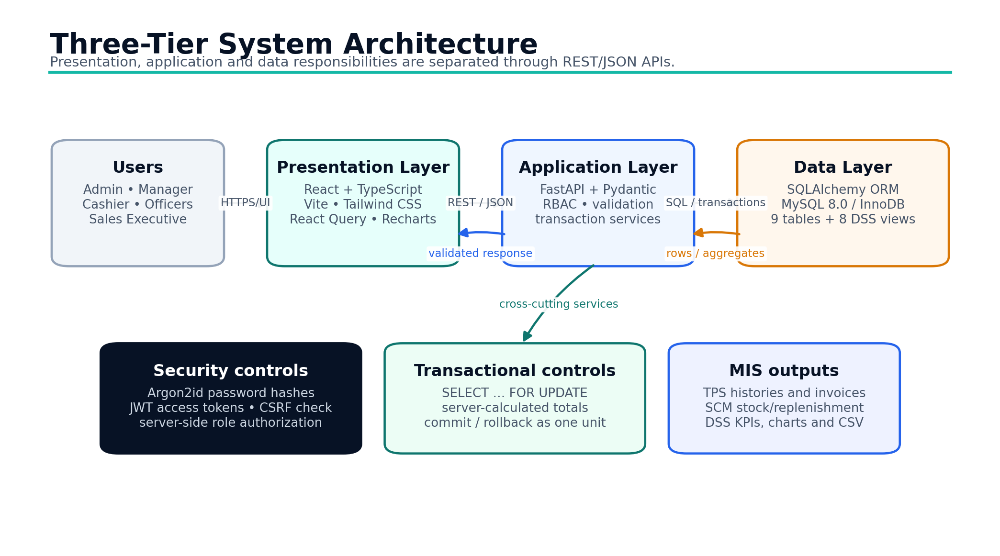
</p>

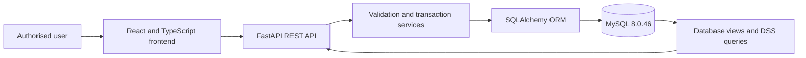

## Technology stack

| Layer | Technologies | Responsibility |
|---|---|---|
| Frontend | React, TypeScript, Vite, Tailwind CSS | Responsive component-based interface |
| Data fetching and forms | TanStack Query, React Hook Form, Zod | API caching, form state and immediate validation |
| Visuals and frontend tests | Recharts, Lucide React, Vitest | Charts, icons and frontend test support |
| Backend | Python, FastAPI, Pydantic, Uvicorn | Typed REST API, request validation and application hosting |
| Data access | SQLAlchemy, MySQL Connector/Python | ORM mapping, sessions and database connectivity |
| Database | MySQL 8.0.46 | Transactions, constraints, row locks, normalized tables and views |
| Security | Argon2id, PyJWT | Password hashing and signed authentication tokens |

## Transaction integrity

### Sale transaction

1. Duplicate cart products are aggregated.
2. The customer and active products are validated.
3. Selected product rows are locked with `SELECT ... FOR UPDATE`.
4. Selling prices are read from the database rather than trusted from the browser.
5. Stock is checked and rechecked before deduction.
6. The sale header, detail rows and stock reductions are saved together.
7. The session commits completely or rolls back completely; insufficient stock returns HTTP `409`.

### Purchase transaction

1. Duplicate lines using the same purchase price are consolidated.
2. The supplier and active products are validated.
3. Products assigned to another supplier are rejected.
4. Selected product rows are locked.
5. The purchase total is calculated by the backend.
6. Purchase header/details, stock increases and current-cost updates are saved together.
7. Any failure rolls back the complete operation.

These rules prevent partial invoices, negative stock caused by ordinary checkout races, and client-side total manipulation.

## Security model

- **Argon2id password hashing** for current credentials.
- **Legacy SHA-256 recognition** so a valid legacy password can be upgraded to the stronger format.
- **JWT access and refresh tokens** with subject, role, token type, issue time, expiry and unique token ID claims.
- **Active-user verification** against the current database record on authenticated requests.
- **Endpoint RBAC** using server-side role dependencies.
- **CSRF validation** for unsafe cookie-authenticated requests using matching cookie and header tokens.
- **Server authority** over prices, totals and stock decisions.
- **Layered validation** through React Hook Form/Zod, Pydantic, service rules and database constraints.

## Database design

The MySQL schema contains nine normalized tables:

1. `Categories`
2. `Users`
3. `Suppliers`
4. `Customers`
5. `Products`
6. `Purchases`
7. `Purchase_Details`
8. `Sales`
9. `Sales_Details`

<p align="center">
  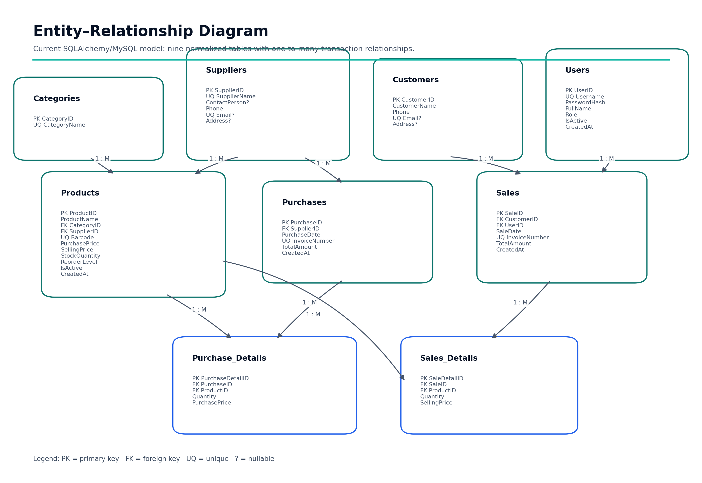
</p>

The schema separates master data from transaction headers and line details. Primary keys provide entity identity; foreign keys connect transactions to customers, users, suppliers and products; unique constraints protect usernames, category/supplier names, emails, barcodes and invoice numbers. Monetary values use `DECIMAL(12,2)`.

## Decision-support reports

The Reports module exposes nine operational and managerial reports:

| Report | Management question answered |
|---|---|
| Low-inventory alerts | Which active products need immediate replenishment, and from which supplier? |
| Top 10 profitable products | Which products contribute the most estimated gross profit? |
| Monthly sales and gross profit | How do revenue and estimated profit change by month? |
| Inventory valuation | How much capital is held in stock, and what is its potential retail value? |
| Profit by category | Which categories contribute the most revenue and estimated profit? |
| Customer analysis | Which customers are repeat or high-value customers under the current rules? |
| Sales invoice details | Which product, customer and cashier produced each invoice line? |
| Sales history | What is the chronological record of completed sales? |
| Purchase history | What stock was received from suppliers and at what total cost? |

Reports are generated from an allow-listed service mapping. CSV export is implemented in the interface and API, although the final evidence matrix records the download scenario as not runtime-tested.

<p align="center">
  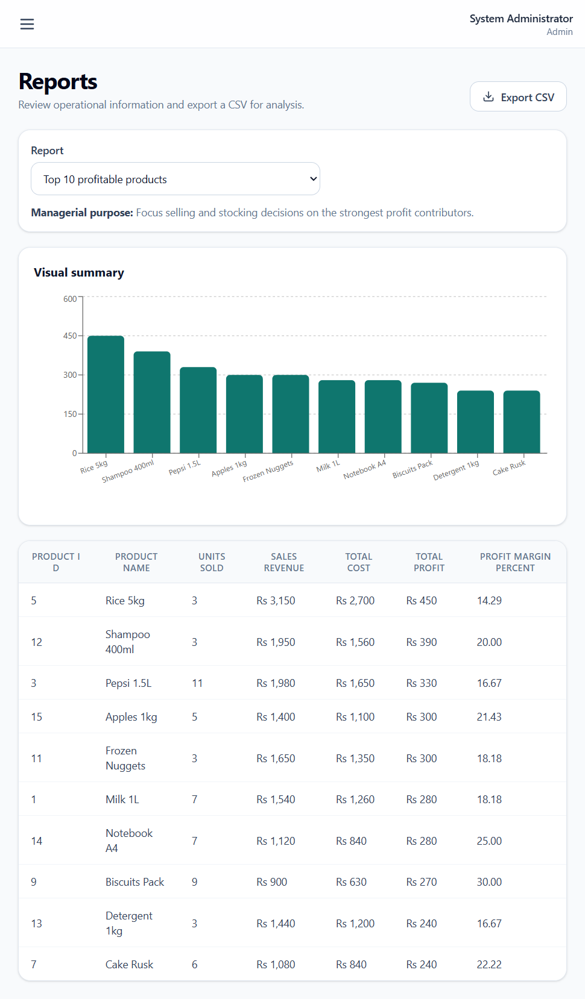
  &nbsp;&nbsp;
  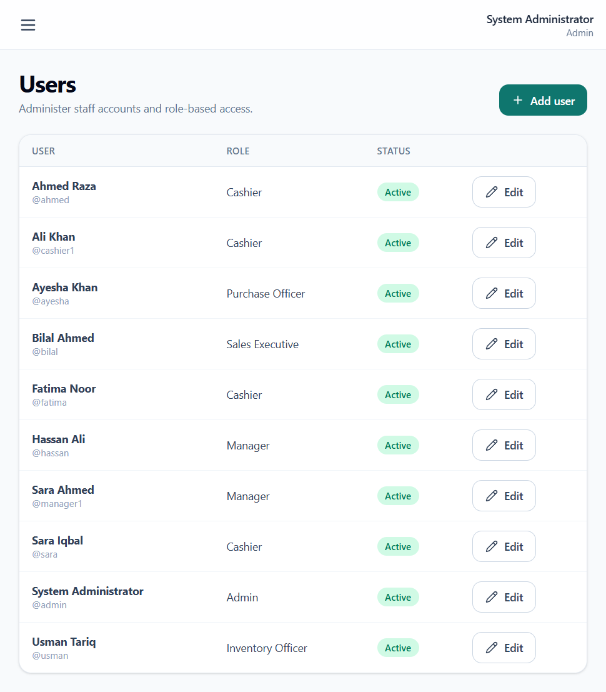
</p>

## Verified demonstration evidence

The following values were observed in the demonstration dataset on **21 July 2026**:

| KPI | Verified value | KPI | Verified value |
|---|---:|---|---:|
| Total sales revenue | **Rs 20,510** | Estimated gross profit | **Rs 3,920** |
| Inventory cost | **Rs 106,016** | Potential retail | **Rs 130,500** |
| Low-stock products | **3** | Products / invoices / customers | **15 / 19 / 10** |

Verified transaction examples:

- **Sale:** 2 × Pepsi 1.5L at Rs 180 plus 1 × Biscuits Pack at Rs 100 produced a **Rs 460** invoice for Usman Tariq.
- **Purchase:** 5 × Bread Loaf at Rs 80 produced a **Rs 400** purchase, increased stock from **6 to 11**, and reduced the low-stock count from **4 to 3**.
- **Current alerts:** Apples 1kg = 7/10, Milk 1L = 7/10 and Potato Chips = 9/10.

> These values change as transactions are recorded. Revenue is not cash flow, potential retail is not guaranteed revenue, and estimated gross profit is not audited net profit.

### Profit calculation caveat

The current reports estimate gross profit using:

```text
Σ Quantity × (SellingPrice − current Product.PurchasePrice)
```

`Sales_Details` preserves the sold unit price, but it does not preserve the product cost at the time of sale. Historical estimated profit can therefore change after the current purchase price is updated.

## Project structure

```text
POS_IMIS_App/
├── web-v2/
│   ├── frontend/
│   │   ├── src/
│   │   │   ├── api/          # API client and error handling
│   │   │   ├── auth/         # Authentication context
│   │   │   ├── components/   # Shared UI and data-table components
│   │   │   ├── layouts/      # Role-aware application shell
│   │   │   └── pages/        # Dashboard, POS, purchases, reports and CRUD pages
│   │   └── package.json
│   └── backend/
│       ├── app/
│       │   ├── api/          # Dependencies and route handlers
│       │   ├── core/         # Configuration, permissions and security
│       │   ├── db/           # Session, ORM models and database audit
│       │   ├── schemas/      # Pydantic request/response models
│       │   ├── services/     # Transactions and reporting logic
│       │   └── main.py       # FastAPI application entry point
│       └── requirements.txt
├── docs/
│   ├── diagrams/
│   └── screenshots/
├── POS_IMIS_database.sql
├── .env.example
├── .gitignore
└── README.md
```

## Local setup

### Prerequisites

- Python and `pip` — the verified development environment used Python 3.14.x.
- Node.js and `npm`.
- MySQL Server 8.0.46 and MySQL Workbench or another MySQL client.
- Git.

### 1. Clone the repository

```powershell
git clone https://github.com/YOUR-USERNAME/smartmart-pos-inventory-mis.git
cd smartmart-pos-inventory-mis
```

Replace `YOUR-USERNAME` with the repository owner's GitHub username.

### 2. Prepare MySQL

Import `POS_IMIS_database.sql` into MySQL. Review the script before execution and use a dedicated local database account where practical.

Create the backend `.env` file using the settings declared in `web-v2/backend/app/core/config.py`. If `.env.example` is retained, first confirm that it matches the current FastAPI configuration rather than the removed Streamlit application.

Never commit the real `.env` file.

### 3. Start the FastAPI backend

```powershell
cd web-v2\backend
python -m venv .venv
.\.venv\Scripts\Activate.ps1
python -m pip install --upgrade pip
python -m pip install -r requirements.txt
python -m uvicorn app.main:app --reload --host 127.0.0.1 --port 8000
```

Backend address:

```text
http://127.0.0.1:8000
```

### 4. Start the React frontend

Open a second PowerShell terminal:

```powershell
cd web-v2\frontend
npm install
npm run dev
```

Frontend address:

```text
http://127.0.0.1:5173
```

Keep both terminals running while using the application.

### 5. Account setup

Use an active database user with an Argon2id password hash. This repository intentionally does not document real passwords or secrets. Create or reset accounts through the project's approved database/application workflow for your local environment.

## Testing evidence

The table below distinguishes runtime evidence from implementation inspection.

| ID | Scenario | Expected result | Status |
|---|---|---|---|
| T01 | Valid administrator login | Dashboard opens | **Passed** |
| T02 | Invalid credentials | Generic denial | Not tested |
| T03 | Cashier/Manager navigation | Only allowed modules are shown | **Passed** |
| T04 | Direct request to denied endpoint | HTTP 403 | Code verified |
| T05 | Missing product fields | Validation feedback | **Passed** |
| T06 | 2 Pepsi + 1 Biscuits | Rs 460 invoice | **Passed** |
| T07 | Quantity above available stock | HTTP 409 and no partial sale | Code verified |
| T08 | 5 Bread at Rs 80 | Rs 400 purchase and stock +5 | **Passed** |
| T09 | Bread crosses reorder level | Alert count changes from 4 to 3 | **Passed** |
| T10 | Low-stock, Top 10 and monthly reports | Current charts and tables | **Passed** |
| T11 | CSV export | Valid download | Not tested |
| T12 | Concurrent final-unit sales | One succeeds and one returns 409 | Code verified |

**Code verified** means the relevant implementation logic was inspected, but the runtime condition was not executed. It is not reported as a passed test.

## Known limitations

- Historical cost-at-sale is not stored, so profit remains an estimate using current product cost.
- Purchases do not currently store the user who received the purchase.
- Delete behaviour is not declared as MySQL `ON DELETE CASCADE`; a restrict/soft-deactivation policy should be formalized.
- Existing MySQL views use a local root definer and should be recreated under a least-privilege deployment account.
- CSV formula neutralization is not evidenced.
- Future transaction dates are currently accepted.
- Automated negative, rollback, authorization, concurrency and load testing is incomplete.
- Production HTTPS, hardened headers/cookies, rate limiting, monitoring and backup drills are not demonstrated.

## Roadmap

### Priority 1

- Store historical cost and implement an appropriate valuation method such as weighted average or FIFO.
- Align active/inactive product filters across dashboard and detailed reports.
- Automate security, validation, rollback and concurrent-stock tests.

### Priority 2

- Add returns, discounts, taxes and payment methods.
- Store the purchase creator for stronger accountability.
- Neutralize spreadsheet formula prefixes during CSV export.

### Priority 3

- Support barcode hardware, batches and expiry dates.
- Add multi-store inventory, monitoring and automated backups.

### Research direction

- Evaluate explainable, human-approved demand forecasting only after sufficient clean longitudinal data is available.

## Academic information

| Item | Details |
|---|---|
| University | University of Central Punjab |
| Department | Computer Science |
| Course | Introduction to Management Information Systems (IMIS) |
| Section | BSCS-6A |
| Instructor | Saman |
| Business case | SmartMart Retail Store — fictional academic case |
| Submission date | 21 July 2026 |

### Group members

| Name | Registration number |
|---|---|
| Muhammad Rehan | S3F23UBSCS023 |
| Jawaria Zeeshan | S3F23UBSCS025 |
| Sidra Naeem | S3F23UBSCS009 |
| Muhammad Ihtesham | S3F23UBSCS004 |
| Muhammad Qasim | S3F23UBSCS075 |

## Responsible-use note

This repository is an academic prototype. Before any production deployment, review secrets management, database privileges, HTTPS, security headers, rate limiting, monitoring, backup/restore procedures, concurrency testing, accessibility and applicable financial/retail requirements.

---

<div align="center">

**Built to demonstrate how validated transactions become reliable management information.**

</div>
